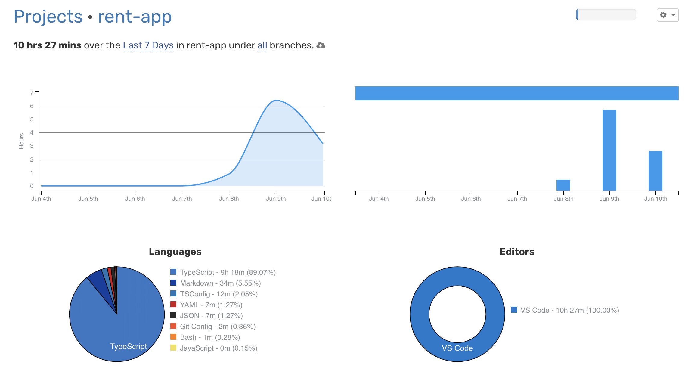

# My Project

## Running the project

1. Clone the repository
2. Install dependencies: `npm install`
3. Create Mock data: `npm run seed`
4. Run the project: `npm run dev`

## Postman Collection

The Postman collection for testing the API endpoints is included in the `postman` directory.

### Importing the Postman Collection

1. Open Postman.
2. Click on the **"Import"** button.
3. Select the **"Upload Files"** tab.
4. Navigate to the `postman` directory and select the JSON file.
5. Click **"Open"** to import the collection.

You can now see all the API requests in Postman and test the endpoints easily.

## API Documentation(not completed)

The API documentation is available at [http://localhost:3000/api-docs](http://localhost:3000/api-docs).

## Project Structure

```
my-project/
├── src/
│ ├── controllers/
│ │ ├── bookingController.ts
│ │ ├── favoritesController.ts
│ │ └── userController.ts
│ ├── models/
│ │ ├── booking.ts
│ │ ├── favorite.ts
│ │ ├── house.ts
│ │ └── user.ts
│ ├── routes/
│ │ ├── bookingRoutes.ts
│ │ ├── favoriteRoutes.ts
│ │ ├── houseRoutes.ts
│ │ └── userRoutes.ts
│ │
│ ├── services/
│ │ ├── bookingService.ts
│ │ ├── favoriteService.ts
│ │ ├── houseService.ts
│ │ └── userService.ts
│ │
│ │── dtos/
│ │── interfaces/
│ ├── app.ts
│ └── server.ts
├── .env
├── .gitignore
├── package.json
├── tsconfig.json
└── README.md
```

## API Endpoints

### Get a user by Id

- `GET /users/:id`

### Search houses based on latitude and longitude

- `GET /houses/search?latitude=<latitude>&longitude=<longitude>`

### Create a new booking for a house

- `POST /bookings`
  - Body:
    ```json
    {
      "guest_id": "<guest_id>",
      "host_id": "<host_id>",
      "house_id": "<house_id>",
      "total_price": <total_price>
    }
    ```

### Add a house to favorites list of a user

- `POST /favorites`
  - Body:
    ```json
    {
      "user_id": "<user_id>",
      "house_id": "<house_id>"
    }
    ```

## Time spend on the project:



## Incoming changes:

1. Add validation for inputs

2. Create simple Id fields

3. Embed Documents

4. Validation middleware
